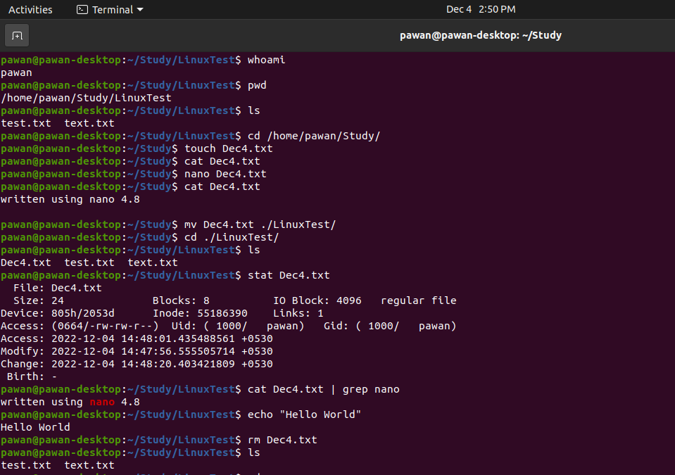

 Basic Commands
 =========================================
 **whoami**
 <br/>use this command to check current logged in user.

 **pwd**
 <br/>to get the working directory in the directory tree.
 
 **ls**
 <br/>to get content of the directory, there are flags such as ```-l``` (all listing), ```-a``` (shows even hidden files), ```-c``` (shows recently modified files).
 
 **cd**
 <br/>use ```cd <directory>``` to change working directory.

 **touch**
 <br/>create an epmty file using ```touch <filename>```
 
 **cat**
 <br/>to print content of a file to the terminal. Syntax to get the content ```cat <filename>```
 
 **nano**
 <br/>Nano is built in text editor. You can edit a file with command ```nano <filename>```. (use ```ctrl + x``` to exit it)
 
 **mv**
 <br/>to move a file to another location. Syntax ```mv <filename> <destination-directory>```
 
 **cp**
 <br/>to copy a file to another location. Syntax ```cp <filename> <destination-directory>```
 
 **mkdir**
 <br/>to create a directory, use command ```mkdir <directory-name>```
 
 **rm**
 <br/>to delete files, use command ```rm <filename>```
 
 **rmdir**
 <br/>to delete directory, use command ```rmdir <directory-name>```
 
 **stat**
 <br/>this command gives information about a file, ```stat <filename>```
 
 **echo**
 <br/>to print to console, ```echo "Hello World"```
 
 **grep**
 <br/>grep is global regular expression program, it searches for a given text. Syntax ```cat <filename> | grep <text>``` this will search ```text``` in the file.

 
